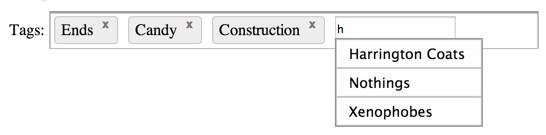
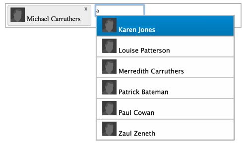

ember-xautosuggest
=================
[](http://travis-ci.org/dockyard/ember-validations)



This component will auto-complete or autosuggest completed search queries for you as you type.

There is keyboard navigation using the up and down keys to scroll up and down the results and enter adds the selection,
while hitting escape hides the autocomplete menu.

## Usage
```
{{x-autosuggest source=controller destination=tags}}
```
- Specify a `source` binding that displays a list of selections to choose from.
- Specity  a `destination` binding that your selections will be bound to.

### Arguments
- `searchPath` - Specify the property for each object in the `source` list that will be used to auto suggest, the default is `name`.

```
{{x-autosuggest source=controller destination=tags searchPath=make}}
```

- `minChars` - Specify how many characters the user must enter into the input before the search is triggered, the default is `1`.
```
{{x-autosuggest source=controller destination=tags minChars=0}}
```

### Customise Suggestions and Results
- You can prepend content to the suggestions and the results by using the component in its block form:
```
    {{#x-autosuggest source=controller.employees destination=tags searchPath="fullName" minChars=0 as |selection|}}
      
    {{/x-autosuggest}}
```

- The above declaration will result in the following markup:



### Query an Ember-Data model
Generate ember-data type ```findQuery``` queries on the remote server by getting a reference to the type.
```
// controller
import Employee from '../models/employee';

export default Ember.Controller.extend({
  chosenEmployees: Ember.A(),
  Employee: Employee
});

```
Then setting the type as the source of the ```x-autosuggest``` component.
```
{{x-autosuggest source=Employee destination=chosenEmployees searchPath="fullName" minChars=0}}
```
This will call findQuery with an expression created from the **searchPath**.  In the above example, that would be:
```
store.find(Employee, {fullName: '<query>'});
```
### View the demo
```
cd tests/dummy
ember server
open a browser at http://localhost:4200/

```

## Building yourself ##

```bash
npm install
bower install
ember build
```

The builds will be in the `dist/` directory.

## Installing ##

#### With Ember-CLI ####
If you are using
[`ember-cli`](https://github.com/stefanpenner/ember-cli) you can add
`emberx-autosuggest` to your `package.json`:

```javascript
"devDependencies": {
  ...
  "emberx-autosuggest": "~ 0.0.1"
}
```

You may want to be more precise with your version locking.

## Running Tests

* `ember test`
* `ember test --server`
